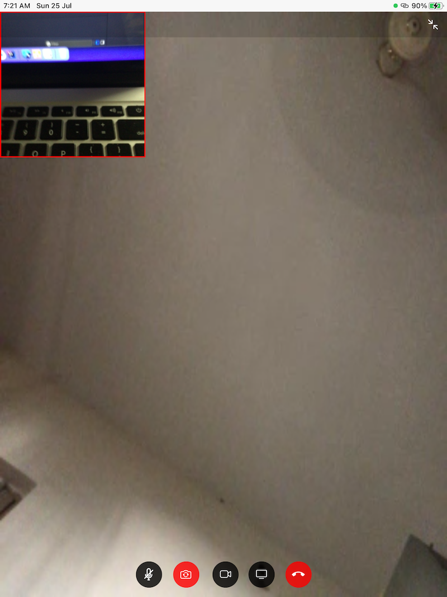
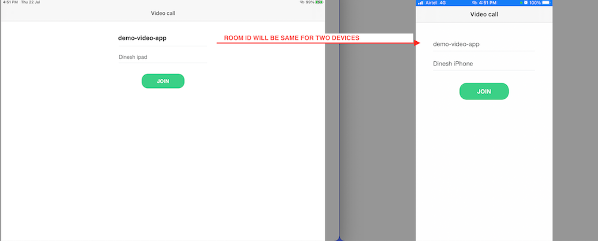
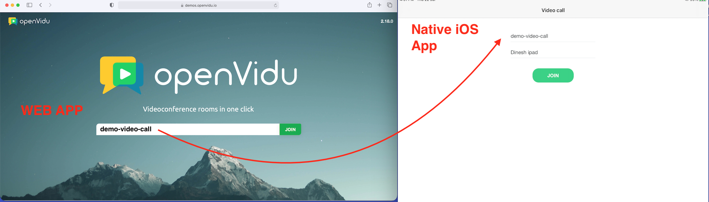

# openvidu-ios
Video call app using openvidu - webRTC

Openvidu website
https://openvidu.io

## Flow

  

  

#### Steps to connect video call between two iOS devices
- Run this project in two iOS devices
- Enter the Same RoomID in both devices (Minimun 15 characters)
- Enter the username and click join
- Mute video & audio, do iOS device screen share, toggle front & back camera
#### Steps to connect video call between iOS device & web
- open your browser and go to https://demos.openvidu.io/openvidu-call/#/
- By default, RoomID already generated in web app.
- Enter the same RoomID (web app room id) to iOS device
- Join call

## Pods used
 - 'GoogleWebRTC' - WebRTC client
 - 'Starscream', - Web Socket connection
 - 'MBProgressHUD' - Showing progress indicator